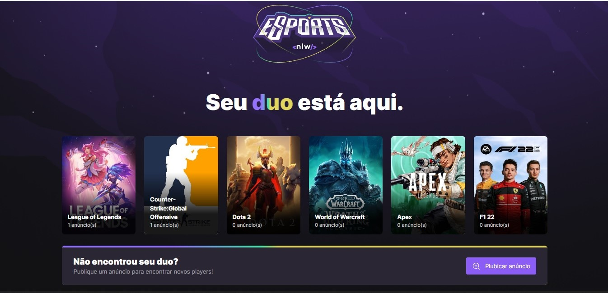
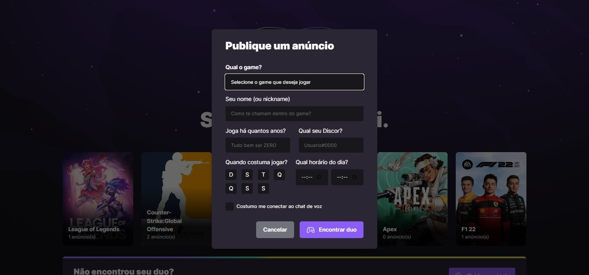
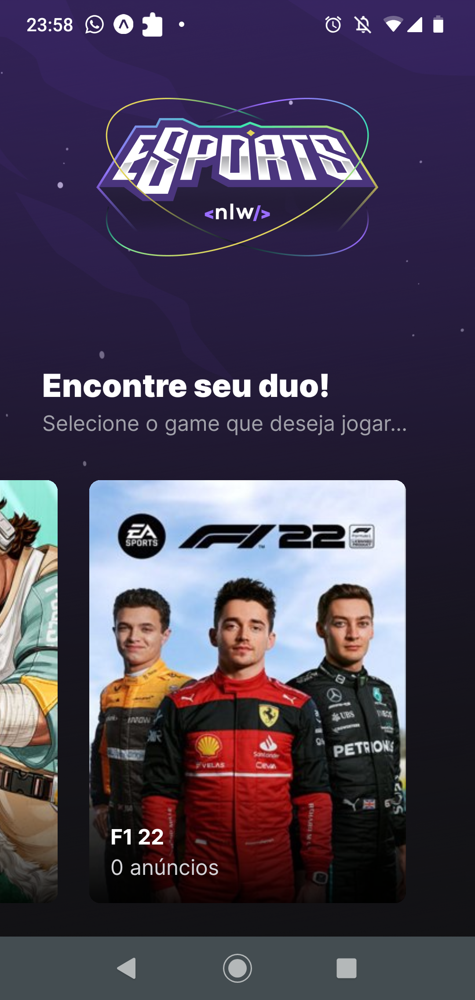
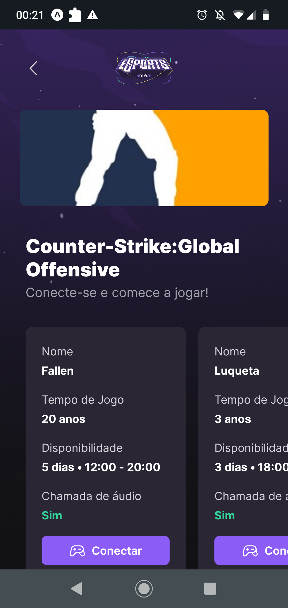
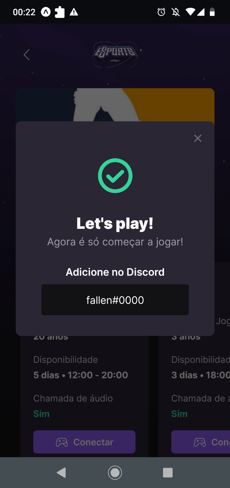

# Esports
 NLW esports foi um evento de devs realizado pela [Rocketseat](https://www.rocketseat.com.br/), no qual, são 6 dias de bastante aprendizados sobre programação e como ser um profissional de qualidade para o mercado de tecnologia.
 Nesta edição, é criado um aplicação de Esports onde gamers podem encontrar um duo para jogar um game juntos, sendo que um usuário pode publicar pela a WEB um anúncio do game que quer jogar ou pelo app mobile procurar um duo para jogar.
 NEVER STOP LEARNING

## Tecnologias utilizadas no Back-end
- Nodejs
- TypeScript
- SQLite

## Tecnologias utilizadas no Front-end
- React
- React Native

## Funcionalidades da WEB
- Vizualizar anúncios de games.
- Cadastrar Duo para determinado game.

## Funcionalidades do Mobile
- Vizualizar anúncios de games.
- Selecionar game e escolher um Duo para jogar através do usuário do discord.

## WEB 

### Tela de anúncios

  

### Tela de Publicar um anúncio

  

## Mobile 

### Tela de anúncios

  

### Tela de Duos

  

### Tela de Discord

  

